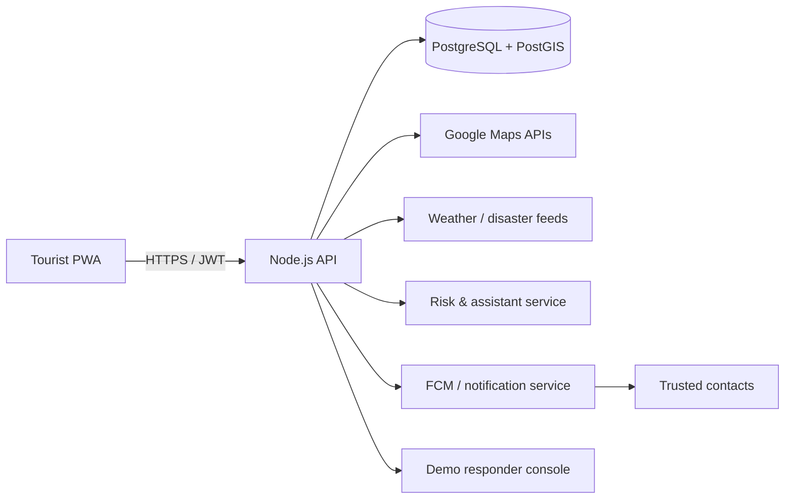
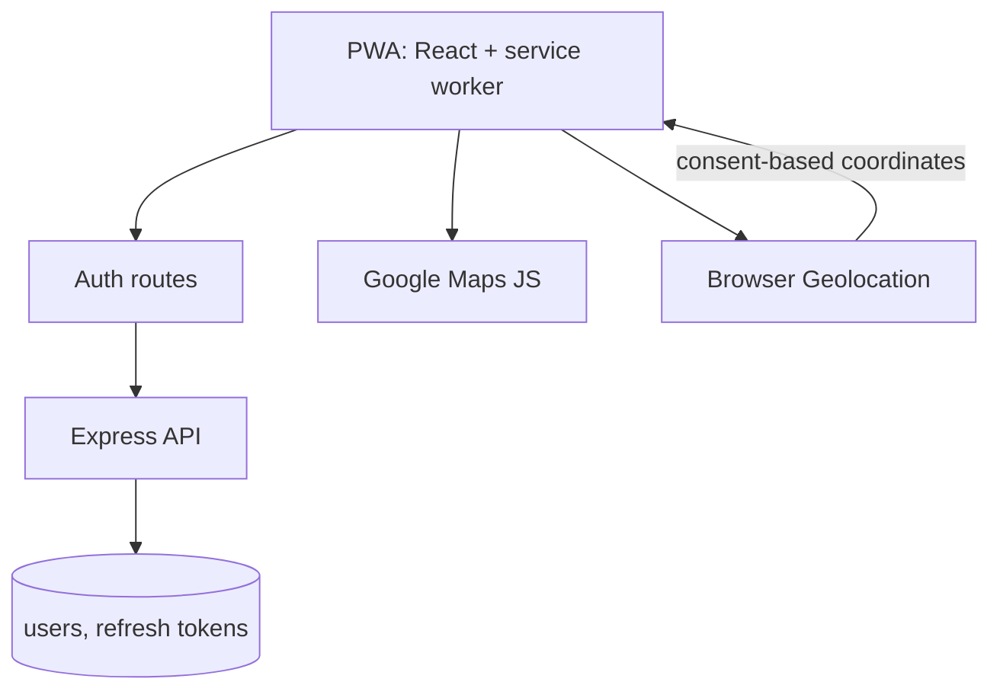
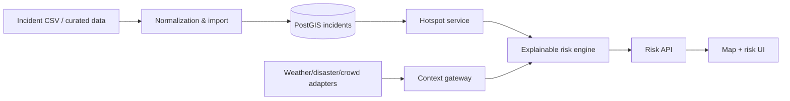
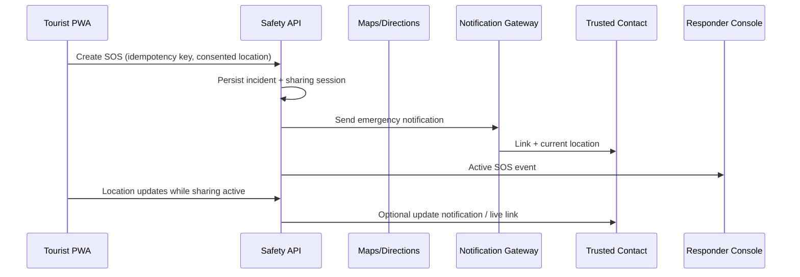
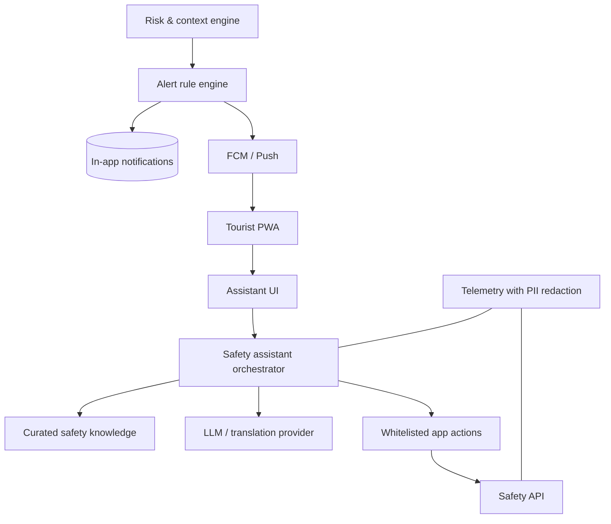

# VoyageSecure SafeTrail AI

Mobile-first tourist safety monitoring and incident-response platform for a Smart India Hackathon prototype. VoyageSecure SafeTrail helps a tourist understand local safety context, choose a lower-risk route, find nearby help, and share an SOS with trusted contacts.

> **Safety note:** This is an advisory prototype for a pilot city. It must never claim to guarantee safety or replace official emergency services. In India, display the official emergency number **112** prominently in the app.

## What the prototype delivers

- Privacy-led sign-in, profile and location consent
- Current-location safety map with aggregated crime hotspot information
- Explainable risk score based on time, local incidents, weather/disaster and crowd signals
- Fastest-versus-safety-weighted route comparison
- Nearby police, hospitals and ambulance services
- One-touch SOS, time-boxed live location sharing and trusted-contact notification
- Grounded multilingual assistant (English, Hindi and a pilot-city language)
- In-app/push notifications and a role-protected demo responder view

## Repository layout

```text
apps/
  web/                 React + Vite mobile PWA
  api/                 Node.js + Express REST API
  ai-service/          Python FastAPI risk/assistant service
packages/
  shared-types/        Shared request/response types
  ui/                  Reusable accessible UI components
data/
  seed/                Public, versioned pilot-city demo data only
docs/                  Data cards, runbooks and evidence
db/
  migrations/          Numbered SQL migrations
  schema.sql           Reference schema (also mirrored at project root)
```


## Useful commands

| Command | Purpose |
|---|---|
| `npm run dev` | Start web/API development processes |
| `npm run lint` | Run code style and static checks |
| `npm test` | Run unit tests |
| `npm run test:integration` | Run API/database integration tests |
| `npm run build` | Build all deployable apps |
| `npm run db:migrate` | Apply numbered database migrations |
| `npm run db:seed` | Load safe pilot-city demo fixtures |
| `pytest` | Run AI-service tests |

## Configuration reference

| Variable | Used by | Notes |
|---|---|---|
| `DATABASE_URL` | API, AI service | Never use production data locally |
| `JWT_SECRET` or `AUTH_PROVIDER_*` | API | Use a long, unique secret per environment |
| `GOOGLE_MAPS_API_KEY` | Web | Browser key, origin-restricted; no server privileges |
| `GOOGLE_ROUTES_API_KEY` | API | Server-only, API-restricted |
| `AI_SERVICE_URL` | API | Internal service URL |
| `LLM_API_KEY` | AI service | Server-only; do not log requests containing PII |
| `FCM_*` / `PUSH_VAPID_*` | API/web | Notifications; in-app inbox remains the fallback |
| `DEMO_MODE` | All | Enables fixtures, never real emergency dispatch |

## Quality gates before a demo

- [ ] User can sign in, deny location safely, then select a city manually.
- [ ] Risk displays score, explanation, source freshness and confidence.
- [ ] Safe route clearly labels itself advisory; fastest route is still shown.
- [ ] SOS is idempotent, cancellable, rate-limited, and testable with fake contacts.
- [ ] Assistant never invents emergency numbers/locations and offers a safe fallback.
- [ ] External API outage is survivable in demo mode.
- [ ] Mobile accessibility and critical journeys are tested on a real device.

## Documentation map

- [Architecture](ARCHITECTURE.md) — services, boundaries, data flow and security
- [API schema](API_SCHEMA.md) — REST contracts and error model
- [Database schema](schema.sql) — reference PostgreSQL/PostGIS schema
- [AI prompt and safety policy](AI_PROMPT.md) — grounded assistant contract
- [Technology choices](TECH_STACK.md) — rationale and alternatives
- [Blueprint](blueprint.md) — product scope and delivery phases
- [Team backlog](TODO.md) — ready-to-execute work board

# AI-Based Smart Tourist Safety Monitoring & Incident Response System

## 30-Day Internal Hackathon Execution Blueprint

**Team:** 4 developers · **Target:** mobile-first PWA · **Delivery style:** demonstrable vertical slices every week

> **Product promise:** A tourist can see their contextual safety risk, choose a safer route, find verified help nearby, and send a location-aware SOS in under 10 seconds.

## 1. Executive roadmap

| Phase | Days | Milestone | Demo outcome |
|---|---:|---|---|
| 1 — Foundation | 1–7 | Trustworthy app shell | Sign in, grant location, explore a polished map |
| 2 — Intelligence | 8–14 | Risk-aware backend | Risk score and crime-hotspot explanation from seeded data |
| 3 — Response | 15–21 | Action under pressure | Safer route, nearby help, SOS and responder workflow |
| 4 — Launch & story | 22–30 | Complete journey | Multilingual assistant, alerts, deployed and rehearsed demo |

### Architecture evolution



### Scope guardrails

- **Build for one pilot city** (for example, Delhi, Jaipur, or Bengaluru) and seed a credible NCRB-derived/demo dataset. National real-time coverage is a future capability, not a 30-day promise.
- Treat risk scores as **advisory**, not a guarantee of safety. Show the main contributing factors and an emergency disclaimer.
- Use provider data only where permitted. For the demo, curate static disaster/crowd inputs behind the same API used by live feeds.
- Keep the SOS path operational even if the AI service is unavailable: location + contacts + nearby emergency information always wins.

---

# Phase 1 — Foundations (Days 1–7)

## Phase goal

Deliver a secure, attractive mobile-first application shell where a tourist can create an account, consent to location use, and explore their location on an interactive map.

### Primary objectives

1. Establish repository, environments, UI design language, authentication, and API conventions.
2. Integrate Google Maps safely and render current location plus key map controls.
3. Build the high-confidence entry journey: landing → sign in → permission education → safety home.

### Expected outcomes and success criteria

| Outcome | Success criterion |
|---|---|
| Account access | Sign-up/sign-in/sign-out and protected routes work on mobile and desktop |
| Map experience | Map loads under 3 seconds on a normal connection; user location is displayed after consent |
| Quality baseline | Lighthouse mobile Accessibility ≥90, no critical dependency vulnerability, CI passes |
| Demo readiness | A new user reaches the map in ≤5 taps with a clear privacy explanation |

## Features to complete

| Feature | Functional requirements | Non-functional requirements | Dependencies | Priority |
|---|---|---|---|---|
| Authentication | Email/password sign-up, sign-in, sign-out, session restore, profile name | Passwords never stored by app; JWT expiry; friendly errors | Auth provider / API | P0 |
| Safety home | Greeting, location state, map, visible SOS placeholder, risk card placeholder | 360–430 px first; keyboard support; skeleton loaders | Auth, Maps | P0 |
| Google Maps | Current location, recenter, zoom, marker, API-error fallback | Restrict key by referrer; lazy-load; location only after consent | Maps JS + Geolocation | P0 |
| Privacy & consent | Explain why location is requested; opt out; link privacy note | No continuous tracking by default | UI | P0 |
| UI system | Colors, typography, buttons, cards, status chips, toasts | WCAG AA contrast; no color-only signals | Frontend | P1 |


## Architecture update



**New components:** PWA shell, auth middleware, profile service, Maps adapter, consent manager, staging pipeline. Keep Maps calls behind `MapProvider` so Google can be swapped or mocked.

## UI/UX tasks

Build: landing page, sign-up/sign-in, onboarding, permission explainer, safety home/map, profile menu, global error/offline views. Bottom navigation reserves **Home**, **Explore**, **SOS**, **Assistant**, **Profile**; disabled future tabs can be labelled “Coming soon” only in the internal build, not the pitch demo.

Accessibility: semantic labels for map controls, 44×44 px touch targets, visible focus, non-color status icons/text, plain-language location explanation, reduced-motion support, and location permission fallback that allows manual city selection.

## Testing strategy

- **Unit:** form validation, token parsing, auth middleware, map state reducer.
- **Integration/API:** registration/login/profile with a test DB; duplicate account and expired token tests.
- **Performance:** bundle-size budget; Maps lazy-load only after sign-in.
- **Security:** `.env` secret scan, dependency audit, CORS allowlist, rate limit on login.
- **UAT:** one non-technical student completes onboarding unaided and reports confusing copy.

## DevOps & deployment

CI: install → lint → unit/API test → build → dependency scan. CD: deploy `main` to staging after CI. Environment variables: `DATABASE_URL`, `JWT_SECRET`/auth provider keys, `GOOGLE_MAPS_API_KEY`, `APP_ORIGIN`, `SENTRY_DSN` (optional). Restrict Google keys to staging/production domains and required APIs; do not expose server keys in the browser.

## Risks and mitigation

| Risk | Mitigation / trigger |
|---|---|
| Google billing/key setup delays | Day-1 owner D; use static map mock until key is enabled |
| Location permission denied | Manual city selection and clear, retryable consent screen |
| Auth consumes too much time | Prefer Firebase/Supabase Auth; preserve backend JWT abstraction |
| Polished UI slips | Freeze visual scope on Day 5; fix core states before animations |

## Deliverables checklist and expected demo

- [ ] Staging URL, README, env template and CI badge
- [ ] Authentication and protected home
- [ ] Consent-led Google map with current-location/recenter/fallback
- [ ] Migration + seed process and data limitations card
- [ ] Mobile QA checklist and 2-minute demo script

**Demo:** “Priya arrives in the pilot city, creates an account, sees exactly why the app asks for her location, grants it, and lands on a clean safety map that follows her position.”

---

# Phase 2 — Core Backend & Intelligence (Days 8–14)

## Phase goal

Turn the map into an explainable safety surface by loading crime hotspot data and calculating a contextual, advisory risk score.

### Primary objectives

1. Build a geospatial database model and reproducible data-ingestion path.
2. Deliver a transparent risk engine that combines hotspot, time, weather/disaster and crowd inputs.
3. Expose fast APIs and a clear “why this score?” UI, with safe fallbacks when feeds are stale.

### Expected outcomes and success criteria

| Outcome | Success criterion |
|---|---|
| Hotspots | Map clusters/heatmap show pilot-city data inside the selected viewport |
| Risk | 95% of scenario fixtures return the expected risk band; every score lists contributing factors |
| Speed | P95 risk API <700 ms and nearby-hotspot query <500 ms on seeded data |
| Trust | UI shows data freshness, advisory wording and no unexplained red/green label |

## Features to complete

| Feature | Functional requirements | Non-functional requirements | Dependencies | Priority |
|---|---|---|---|---|
| Crime ingestion | Import CSV/GeoJSON, normalize type/date/lat/lng, reject bad rows | Idempotent, auditable, source-labelled | A’s data card, PostGIS | P0 |
| Hotspot analysis | Grid/cluster aggregation by radius/period/category | Map viewport response <500 ms; cache 5 min | Incidents table | P0 |
| Risk engine | Score 0–100 and band; explain factor weights/freshness | Deterministic v1, testable, fallback inputs | Hotspots, feed adapters | P0 |
| Risk UI | Current risk card, factors, data timestamp, hotspot overlay | Accessible text equivalent; no alarmist language | APIs, Maps | P0 |
| Feed adapters | Weather/disaster/crowd adapter interface with demo fixture | Timeouts/retries; stale-data flag | External feeds | P1 |


## Architecture update



### AI module development — Risk Assessment v1

**Model architecture:** Start with a weighted, explainable rules model—not opaque machine learning. It is credible, fast, debuggable, and appropriate for sparse college-hackathon data. Optional calibration later uses logistic regression/gradient boosting only if labelled historical outcomes are adequate.

**Feature engineering:**

| Feature group | Example transformation | Initial weight cap |
|---|---|---:|
| Hotspot exposure | Incident density in 500 m / city percentile | 45% |
| Time context | Hour-of-week risk multiplier | 15% |
| Incident severity | Weighted category mix | 15% |
| Weather/disaster | Normalized alert severity, fresh within 60 min | 15% |
| Crowd/operational signal | Curated density/event multiplier | 10% |

`risk = clamp(100 × weighted_sum, 0, 100)`. Bands: **0–33 Low**, **34–66 Caution**, **67–100 High**. Return `modelVersion`, `generatedAt`, each factor’s normalized contribution, source timestamps and `confidence`.

**Inference pipeline:** validate coordinate → snap only for aggregate lookup (do not persist routine location) → parallel hotspot/context queries → replace unavailable factors with neutral values → calculate → apply freshness penalty → cache by H3 cell + hour + model version → return explanation.

**Confidence scoring:** starts at 1.0 and subtracts for stale/missing feeds, low incident sample size, and coordinate precision. `High ≥0.8`, `Medium 0.55–0.79`, `Limited <0.55`; limited confidence uses cautious language and exposes data age.

**Optimization:** PostGIS GiST index, pre-aggregate H3/grid cells, Redis/in-memory cache for 5 minutes, bound radii, execute adapters in parallel, and circuit-break slow providers.

**Evaluation metrics:** golden-scenario band agreement ≥95%; factor completeness ≥90%; API P95 <700 ms; calibration check by zone/time; false-alarm review with mentor. Do **not** claim predictive accuracy or prevention efficacy without validated outcomes.


## UI/UX tasks

Build an expandable safety card (band, score, confidence, timestamp), “why am I seeing this?” factor drawer, hotspot legend/filter, low-data message, and contextual bottom sheet when tapping a hotspot. Map markers must be clusterable; never draw every raw incident. Use language such as “Use extra caution” instead of “You are unsafe.”

## Testing strategy

- **Unit/AI:** each feature transformation, clamp/band boundaries, missing/stale-provider behavior, 30+ golden scenarios.
- **Integration:** import → aggregate → API → map; geospatial SQL against known points.
- **API:** contract tests, coordinate injection/invalid bounds, rate limiting, pagination if added.
- **Performance:** 50 concurrent risk requests and 100 viewport hotspot requests.
- **Security/UAT:** ensure precise routine location isn’t written; ask users whether explanations make the score understandable.

## DevOps & deployment

Add PostGIS image/service for local and CI, migration job in staging pipeline, seeded demo dataset, `/health` and `/ready` endpoints, structured request IDs, and dashboards for API latency/feed freshness. New variables: `RISK_MODEL_VERSION`, `CONTEXT_PROVIDER_*`, `CACHE_URL`, `PILOT_CITY_BOUNDARY`.

## Risks and mitigation

| Risk | Mitigation / trigger |
|---|---|
| NCRB data lacks granular location/time | Document grain; supplement only with licensed/citable pilot data; use demos honestly |
| “AI” feels unconvincing | Lead with explainability, data provenance, and calibrated scenarios—not unsupported claims |
| External feeds fail/rate-limit | Fixture fallback, circuit breaker, stale badge and no false “live” label |
| Dense map is unreadable | Aggregate/cluster; progressively reveal details |

## Deliverables checklist and expected demo

- [ ] Versioned crime seed dataset, import log and data card
- [ ] PostGIS schema/migrations/indexes
- [ ] Hotspot layer and risk assessment API
- [ ] Explainable score UI with freshness/confidence
- [ ] Golden scenarios, load-test report, limitations slide

**Demo:** “Priya moves from a low-density daytime area to a high-density late-evening area. The score changes, explains the main contributors, shows its data timestamp, and suggests taking extra care—without pretending to predict a crime.”

---

# Phase 3 — Advanced Safety & Response (Days 15–21)

## Phase goal

Convert risk insight into immediate action: safer routing, nearby verified services, a one-touch SOS, and reliable location sharing.

### Primary objectives

1. Compare default and safety-weighted routes while preserving normal navigation expectations.
2. Provide nearby police, hospitals, and ambulance contacts with clear source/verification labels.
3. Make SOS resilient, confirm before sending, and allow a trusted contact/responder to receive location updates.

### Expected outcomes and success criteria

| Outcome | Success criterion |
|---|---|
| Safer route | User sees fastest vs safety-weighted route, ETA trade-off, and explanation |
| Nearby help | At least 10 pilot-city services seeded/verified; tap opens directions/call action |
| SOS | Trigger, confirmation, contact notification and location event complete in ≤10 seconds under normal network |
| Resilience | SOS queue retries when connectivity returns; critical action has a visible final state |

## Features to complete

| Feature | Functional requirements | Non-functional requirements | Dependencies | Priority |
|---|---|---|---|---|
| Safe route | Origin/destination, fastest/safest alternatives, risk overlay, trade-off disclosure | Response <2.5 s typical; no “guaranteed safe” wording | Directions API, risk cells | P0 |
| Help locator | Filter police/hospital/ambulance; distance, hours, call/directions | Source/date label, accessible list counterpart | Places/seed data, Maps | P0 |
| SOS | Hold/tap button, 3-second cancel window, create incident, share location, notify contacts | Idempotent, auditable, retryable, rate-limited | Auth, notifications | P0 |
| Live sharing | Explicit session duration, start/stop, location updates, shared viewer token | Consent-first; encrypted in transit; expiry | Geolocation, DB | P0 |
| Responder console | Demo-only dashboard shows active SOS and latest location | Role-protected; no public endpoint | SOS API | P1 |


## Architecture update



### Safe-route algorithm

Request route candidates from Google Directions/Routes API. Sample or map-match points along each candidate; query pre-aggregated risk cells; calculate `routeSafetyCost = Σ(cellRisk × segmentLength × freshnessConfidence) + alertPenalty`. Normalize by route length and expose a comparison, not an absolute safety claim. Return the fastest route plus up to two safety-weighted alternatives. Default weights: 70% safety exposure, 20% travel time, 10% route complexity. Let judges see the transparent route factor breakdown.


## UI/UX tasks

Build: destination search/route comparison, safety/ETA trade-off sheet, nearby-help list/map, service detail (call/directions/verified date), trusted contacts, SOS hold-to-send confirmation/cancel state, live-share status with countdown/stop, and role-protected responder board. SOS must be fixed but never obscure map controls; show 112/official local emergency number as a visible fallback, localized by pilot city.

## Testing strategy

- **Unit:** route-cost math, provider fallback, SOS state machine, session expiry, phone normalization.
- **Integration:** create SOS → delivery job → event → responder view; provider mocked in CI.
- **API/security:** idempotency replay, contact ownership, responder RBAC, rate limits, share-token entropy/expiry.
- **Performance:** 100 service/routing API requests, location event batching; no UI lock while sending SOS.
- **UAT:** time three users completing an SOS drill; target under 10 seconds without instruction.

## DevOps & deployment

Add queue/worker for notifications, separate responder role, encrypted provider credentials, delivery retry policy (e.g. 3 exponential attempts), dead-letter logging, alert on failed SOS deliveries, and a synthetic daily “test SOS” in staging only. Variables: `GOOGLE_ROUTES_API_KEY`, `FCM_*`, `SMS_*`/email adapter, `SOS_SHARE_TTL_MINUTES`, `EMERGENCY_NUMBER`.

## Risks and mitigation

| Risk | Mitigation / trigger |
|---|---|
| Users treat route as a safety guarantee | Explicit comparison/disclaimer, factors and fastest-route option |
| SMS provider onboarding delays | Use FCM/email for demo; put call/local emergency action in UI |
| SOS abuse or false trigger | Hold gesture, cancel window, rate limit, event audit, no real emergency-agency integration claim |
| Live location privacy breach | Explicit duration, authenticated viewer link, expiry, encryption, minimum retention |
| Directions quota/cost | Cache candidates, cap route requests, mock in demo backup |

## Deliverables checklist and expected demo

- [ ] Seeded/verified emergency service directory
- [ ] Fastest vs safety-weighted route comparison
- [ ] Nearby police/hospital/ambulance locator with call/directions
- [ ] Trusted contacts, SOS state machine, live-location session and responder console
- [ ] Full emergency drill report and privacy/retention note

**Demo:** “At night Priya chooses a route. The app transparently shows a slightly longer option with lower hotspot exposure. When she feels unsafe, she holds SOS, shares her live location with a trusted contact, and the responder console receives the incident.”

---

# Phase 4 — Final Integration, Multilingual AI & Demo (Days 22–30)

## Phase goal

Ship a polished, reliable, deployable prototype with a multilingual safety assistant, proactive notifications, observability, accessibility, and a compelling judge-ready narrative.

### Primary objectives

1. Add grounded multilingual assistance that guides—not replaces—official emergency services.
2. Complete notification preferences and proactive alert delivery.
3. Harden the product, deploy production-like staging, and rehearse a failure-tolerant demo.

### Expected outcomes and success criteria

| Outcome | Success criterion |
|---|---|
| Assistant | Supports English, Hindi and one pilot-state language; answers from approved project sources and can trigger safe app actions |
| Alerts | Risk/weather/disaster alert reaches opted-in user or visible in-app inbox within 60 seconds in demo |
| Quality | No P0/P1 defects open; Lighthouse A11y ≥92; core journey tested on two mobile devices |
| Pitch | 5–7 minute live demo and 90-second fallback video both work without a live third-party API |

## Features to complete

| Feature | Functional requirements | Non-functional requirements | Dependencies | Priority |
|---|---|---|---|---|
| Multilingual assistant | Language detection/selector, safety Q&A, route/help/SOS deep actions, grounded sources | 2.5 s perceived response target; strict guardrails; accessible chat | LLM/translation, knowledge base | P0 |
| Notification centre | Opt-in preferences, in-app alerts, FCM/push when available, alert detail | Deduplicate, rate-limit, no alert fatigue | Risk/context/SOS | P0 |
| Final polish | Offline/error states, empty data, onboarding copy, app installability | A11y, mobile performance, consistent visual system | All phases | P0 |
| Observability | Client/API errors, latency, delivery/model dashboards | PII redaction, actionable alerts | Deployment | P1 |
| Pitch assets | Architecture, data ethics, roadmap, script/video | Accurate claims only | Stable build | P0 |


## Architecture update



### AI module development — Multilingual Travel Assistant

**Model architecture:** LLM orchestration with retrieval-augmented generation (RAG), not fine-tuning. Curated knowledge contains pilot-city emergency numbers, verified service details, safety FAQ, transport advice, and project privacy/limitations. Language normalization routes Hindi/English/pilot language queries into multilingual retrieval; answer in the chosen language.

**Data flow:** user message → redact obvious PII except explicit SOS intent → classify intent (`safety_info`, `nearby_help`, `route`, `weather`, `sos`, `unsupported`) → retrieve top 3–5 approved chunks → compose policy-bound prompt → model response → validate action/citation schema → render response with source/last-updated → deep-link to trusted in-app action. For SOS intent, the assistant presents a prominent **Start SOS** action and emergency number; it never silently sends an SOS.

**Feature engineering / retrieval:** chunk 250–450 tokens with language, city, topic, source URL, verified date and emergency-critical tags; multilingual embeddings; hybrid vector + keyword retrieval; recency boost; filter by pilot city/language; template direct emergency answers without LLM when facts are known.

**Confidence scoring:** combine retrieval relevance, source freshness, answer-policy validation and intent certainty. High confidence may answer with cited source; low confidence responds conservatively: “I can help you find official nearby services,” with buttons. Never invent numbers, addresses, current danger, or legal/medical advice.

**Performance optimization:** cache common FAQ, precompute embeddings, limit context, stream UI tokens if provider supports it, timeout LLM (fallback to fixed help card), use a compact model for intent/language classification and a larger one only when retrieval supports an answer.

**Evaluation metrics:** 60+ multilingual test prompts; intent accuracy ≥90%; grounded-answer rate ≥90%; harmful/hallucinated emergency details = 0 on red-team set; P95 time-to-first-response <2.5 s (or immediate loading/status feedback); action-routing success ≥95%; human clarity rating ≥4/5 from five student testers.


## UI/UX tasks

Build: assistant tab, language selector (English/Hindi/pilot language), concise starter prompts, message source chips, action cards for “Find hospital”, “Show safer route”, “Start SOS”, notification inbox/badges, preferences, install prompt, skeleton/empty/error/offline states, and a “data & limitations” page. Use translations reviewed by a native/fluent speaker where possible; do not rely on literal machine translations for emergency actions.

## Testing strategy

- **Unit:** prompt schema validation, intent rules, retrieval filters, alert deduplication/quiet hours.
- **AI:** multilingual golden set, hallucination/red-team tests, emergency-route evaluation, provider-timeout fallback.
- **Integration:** risk trigger → rule engine → in-app/push delivery → read state; assistant action → route/SOS confirmation.
- **Performance:** API/worker load test; PWA performance/Lighthouse; large chat text input guard.
- **Security:** prompt injection, XSS in rendered markdown, PII redaction, IDOR on notifications/chat, CSP, secrets scan, OWASP top-10 checklist.
- **UAT:** five students complete “find help,” “ask in Hindi,” “interpret alert,” and “send SOS” scenarios; record confusion/time-to-completion.

## DevOps & deployment

Production-like deployment includes separate staging/production environments, database backup verification, least-privilege service accounts, health/readiness endpoints, error tracking with PII scrubbing, uptime check, dashboards for route/risk latency, notification failure rate, assistant failure/fallback rate, and feature flags for assistant/push. Provide rollback to the prior tagged container/build and keep a local demo mode seeded with fixtures.

Required variables add: `LLM_API_KEY`, `LLM_MODEL`, `EMBEDDING_MODEL`, `VECTOR_DB_URL` (if used), `PUSH_VAPID_*`, `SENTRY_DSN`, `DEMO_MODE`, `PII_REDACTION_ENABLED=true`.

## Risks and mitigation

| Risk | Mitigation / trigger |
|---|---|
| Assistant hallucinates emergency guidance | Curated retrieval, citations, structured validation, fixed emergency templates, fallback buttons |
| API key/quota failure during judging | Cache/fallback; demo-mode fixture dataset; screen-recorded backup |
| Last-minute integration bugs | Feature freeze Day 28; only severity-based fixes afterward |
| Push unavailable on device/browser | In-app notification centre is required; show clear permission state |
| Overclaiming AI/safety impact | Use transparent “advisory prototype” language and limitations slide |

## Deliverables checklist and expected demo

- [ ] Multilingual grounded assistant with English/Hindi/pilot language
- [ ] Assistant test set, safety policy and source register
- [ ] Alert rules, in-app inbox and push fallback
- [ ] Production-like deployed URL, monitoring, rollback/runbook and demo mode
- [ ] Accessibility/security/performance reports and UAT findings
- [ ] 5–7 minute pitch deck, backup video, architecture/data ethics slides

**Demo:** “Priya asks in Hindi where she can get help. The assistant answers from verified sources and opens the nearby-hospital view. A weather/risk alert appears in her inbox. The team closes by showing the SOS drill, responder console, data-source transparency, and a practical roadmap to scale beyond the pilot city.”

---

# Final acceptance gate and presentation plan

## Release checklist

- [ ] All P0 user journeys pass: sign in, map/location fallback, risk explanation, safe route, help locator, SOS/share, assistant, alerts.
- [ ] No P0/P1 defect; all critical errors display a recovery path.
- [ ] Secrets are not committed; API keys restricted; admin/responder endpoints protected.
- [ ] Fresh seeded demo data and a “demo mode” work without unreliable external APIs.
- [ ] Mobile test on at least Android Chrome and iOS Safari (or a documented equivalent).
- [ ] All demo claims match the data card, test evidence, and limitations slide.
- [ ] Backup: screen recording, screenshots, local seed, presenter hotspot, and test account.
