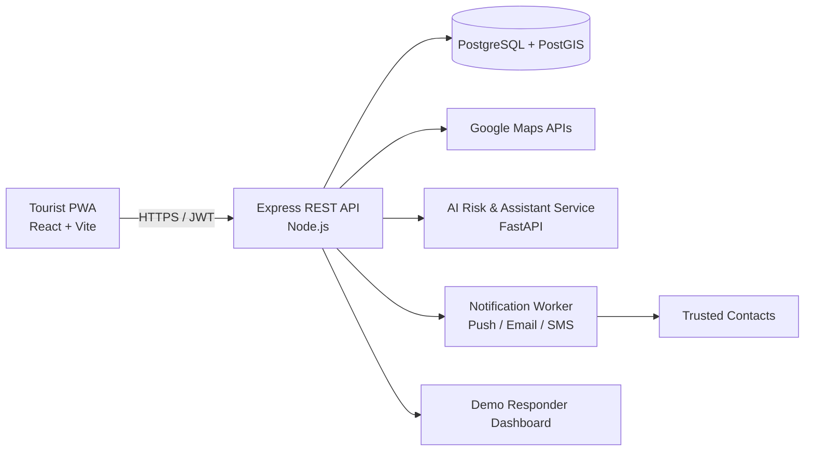

# 🛡️ SecureVoyage — Quick Start & Architecture Guide

<div align="center">


**AI-Powered Smart Tourist Safety Monitoring & Incident Response System**

[Detailed Plan & Specs](docs/DETAILED_README.md) • [Architecture](docs/ARCHITECTURE.md) • [API Schema](docs/API_SCHEMA.md)

</div>

---

> 💡 **Beginner Note:** This is a simplified quick-start guide. For full technical blueprints, deep specifications, and extended checklists, check out [docs/DETAILED_README.md](docs/DETAILED_README.md).

---

## 🎯 What SecureVoyage Does

1. **Safety Map & Hotspots:** Interactive map displaying real-time advisory risk scores & safety hotspots.
2. **Explainable Risk Engine:** Transparent safety score (0–100) based on incidents, time, weather, and crowd data.
3. **Smart Safe Routes:** Compare fastest vs. safety-weighted alternative routes.
4. **Emergency Services Locator:** Instant access to nearby verified police, hospital, and ambulance services.
5. **One-Touch SOS & Live Sharing:** 10-second emergency SOS broadcast with time-boxed location sharing to trusted contacts.
6. **Multilingual AI Assistant:** Grounded AI guide supporting English, Hindi, and pilot languages for safety Q&A.

---

## 🗺️ 30-Day Execution Roadmap & Phase-Wise Architecture Evolution

### 📊 Phase Summary Matrix

| Phase | Days | Milestone | Core Focus |
|---|---:|---|---|
| **Phase 1 — Foundation** | 1–7 | App Shell & Maps | Auth, user consent, interactive map, location display |
| **Phase 2 — Intelligence** | 8–14 | PostGIS & Risk Engine | Crime ingestion, hotspot analysis, explainable risk score |
| **Phase 3 — Response** | 15–21 | Routes, SOS & Help | Safe route options, emergency services locator, live SOS drill |
| **Phase 4 — Launch & AI** | 22–30 | Multilingual AI & Polish | RAG assistant, proactive alerts, deployment & pitch rehearsal |

---

### 🏗️ Phase 1 — Foundation (Days 1–7)

- **Primary Objectives:**
  - Establish repository, environments, UI design system, authentication, and API conventions.
  - Integrate Google Maps safely and render current location plus map controls.
  - Build entry journey: landing → sign in → permission education → safety home.

- **Expected Outcomes & Success Criteria:**
  - **Account Access:** Sign-up/login/logout & protected routes work smoothly on mobile/desktop.
  - **Map Experience:** Map loads in < 3s; location displayed after explicit user consent.
  - **Quality Baseline:** Lighthouse mobile Accessibility ≥ 90; new user reaches map in ≤ 5 taps.

- **Phase 1 Architecture Update:**
  ```mermaid
  flowchart TB
    UI[PWA: React + service worker] --> AUTH[Auth routes]
    UI --> GM[Google Maps JS]
    UI --> GEO[Browser Geolocation]
    AUTH --> API[Express API]
    API --> USERS[(users, refresh tokens)]
    GEO -->|consent-based coordinates| UI
  ```
  *Key additions:* PWA shell, JWT auth middleware, profile service, Maps adapter, location consent manager.

---

### 🧠 Phase 2 — Core Backend & Intelligence (Days 8–14)

- **Primary Objectives:**
  - Build geospatial PostGIS data model & reproducible crime data ingestion pipeline.
  - Deliver transparent risk engine (0–100 score combining hotspot, time, weather/disaster & crowd inputs).
  - Expose fast APIs and intuitive "Why am I seeing this score?" factor UI drawer.

- **Expected Outcomes & Success Criteria:**
  - **Hotspots:** Interactive cluster/heatmap overlay of pilot city data inside active map viewport.
  - **Risk Accuracy:** 95% of test scenario fixtures return expected risk band with explicit factor breakdown.
  - **Speed & Trust:** P95 risk API < 700ms; UI clearly displays data freshness and advisory disclaimers.

- **Phase 2 Architecture Update:**
  ```mermaid
  flowchart LR
    I[Incident CSV / curated data] --> ETL[Normalization & import]
    ETL --> PG[(PostGIS incidents)]
    PG --> HS[Hotspot service]
    W[Weather/disaster/crowd adapters] --> FEED[Context gateway]
    HS --> R[Explainable risk engine]
    FEED --> R
    R --> API[Risk API]
    API --> MAP[Map + risk UI]
  ```
  *Key additions:* PostGIS geospatial schema, crime ingestion ETL, hotspot aggregation service, explainable risk calculation engine, context feed adapters.

---

### 🚨 Phase 3 — Advanced Safety & Response (Days 15–21)

- **Primary Objectives:**
  - Compare default fastest and safety-weighted alternative routes without safety guarantees.
  - Provide nearby police, hospital, and ambulance contacts with verified source labels.
  - Make SOS resilient (3s cancel window), share time-boxed location, and notify trusted contacts.

- **Expected Outcomes & Success Criteria:**
  - **Safer Routes:** Transparent route comparison showing ETA trade-off and safety exposure.
  - **Nearby Help:** ≥ 10 verified pilot-city services seeded; tap opens direct directions or call action.
  - **Resilient SOS:** SOS trigger, notification delivery, & location sharing complete in ≤ 10s.

- **Phase 3 Architecture Update:**
  ```mermaid
  sequenceDiagram
    participant U as Tourist PWA
    participant API as Safety API
    participant MAP as Maps/Directions
    participant N as Notification Gateway
    participant C as Trusted Contact
    participant R as Responder Console
    U->>API: Create SOS (idempotency key, consented location)
    API->>API: Persist incident + sharing session
    API->>N: Send emergency notification
    N->>C: Link + current location
    API->>R: Active SOS event
    U->>API: Location updates while sharing active
    API->>C: Optional update notification / live link
  ```
  *Key additions:* Safety-weighted route comparator, emergency services directory, SOS state machine, location sharing session manager, demo responder dashboard.

---

### 🤖 Phase 4 — Final Integration, Multilingual AI & Demo (Days 22–30)

- **Primary Objectives:**
  - Add grounded multilingual assistant (English, Hindi, pilot language) with strict action guardrails.
  - Complete notification preferences and proactive alert delivery pipeline.
  - Harden product, deploy production-like staging, and rehearse failure-tolerant demo.

- **Expected Outcomes & Success Criteria:**
  - **AI Assistant:** Answers from verified sources only and triggers safe app actions (Find Hospital, Safe Route, SOS).
  - **Proactive Alerts:** Safety alerts delivered to in-app inbox within 60s during demo scenarios.
  - **Judge Readiness:** Zero P0/P1 defects; 5–7 min live demo and 90s fallback video work flawlessly.

- **Phase 4 Architecture Update:**
  ```mermaid
  flowchart TB
    U[Tourist PWA] --> CHAT[Assistant UI]
    CHAT --> ORCH[Safety assistant orchestrator]
    ORCH --> KB[Curated safety knowledge]
    ORCH --> LLM[LLM / translation provider]
    ORCH --> ACT[Whitelisted app actions]
    ACT --> API[Safety API]
    RISK[Risk & context engine] --> RULES[Alert rule engine]
    RULES --> INBOX[(In-app notifications)]
    RULES --> PUSH[FCM / Push]
    PUSH --> U
  ```
  *Key additions:* Multilingual RAG assistant orchestrator, curated safety knowledge base, whitelisted action router, notification alert engine & push service gateway.

---

## 🏗️ Master System Architecture



### Service Responsibilities Summary

- **Web PWA (`apps/web`):** User interface, interactive map, consent controls, SOS UI.
- **Node API (`apps/api`):** Auth/RBAC, database queries, SOS state machine, route aggregation.
- **AI Service (`apps/ai-service`):** Risk scoring formula, factor explanation, multilingual RAG assistant.
- **PostgreSQL + PostGIS (`database`):** Stores crime hotspots, user profiles, emergency services.

---

## 🧪 Testing Strategy

| Level | Scope | Primary Tools |
|---|---|---|
| **Unit Tests** | Auth middleware, risk calculations, route cost formulas, input validation | `Jest` / `Vitest`, `pytest` |
| **API & DB Tests** | REST endpoints, SQL queries, spatial PostGIS queries, JWT verification | `Supertest`, `pytest` |
| **AI Evaluation** | RAG prompt safety, hallucination defense, intent detection accuracy (60+ test cases) | Custom JSONL evals |
| **UAT / Drill** | Emergency SOS speed test (< 10 seconds), mobile UI usability on target resolution (360px) | Manual mobile drill |

---

## ⚡ Useful Commands

```bash
# 1. Install workspace dependencies
npm install

# 2. Start web client and API in development mode
npm run dev

# 3. Run linting & type checks
npm run lint

# 4. Run unit and integration tests
npm test

# 5. Database setup & migrations
npm run db:migrate
npm run db:seed

# 6. Run Python AI Service tests
pytest
```

---

## 📚 Complete Documentation Index

- 📖 [Full Detailed Plan](docs/DETAILED_README.md) — Comprehensive technical blueprint & daily task breakdowns.
- 🏗️ [Architecture Spec](docs/ARCHITECTURE.md) — Security boundaries, data privacy, and fail-safes.
- 📜 [API Schema](docs/API_SCHEMA.md) — REST endpoint contracts and request/response specifications.
- 🗄️ [Database Blueprint](database/blueprint.md) & [SQL Schema](database/schema.sql) — PostGIS database structure.
- 🤖 [AI Safety Guidelines](docs/AI_PROMPT.md) — System prompts, guardrails, and evaluation criteria.
