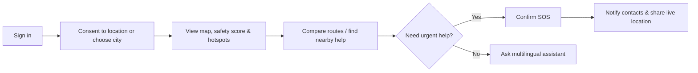

# 📐 Product Blueprint — SecureVoyage

**Problem statement, jobs-to-be-done, delivery phases, success measures, and ethical boundaries.**

---

## 🎯 Problem Statement

> [!IMPORTANT]
> **Core Challenge:** Tourists can struggle to find trusted, timely, and understandable safety guidance when unfamiliar with a place—especially during weather events, at night, or in an emergency. They need clear options and rapid contact with help, not alarming predictions.

---

## 👥 Users & Jobs-To-Be-Done (JTBD)

| User Persona | Need ("When I am...") | Product Response |
|---|---|---|
| **Tourist** | “Help me decide how to move around safely.” | Advisory risk score, hotspot context, and route comparison |
| **Tourist in Distress** | “Let someone I trust know where I am now.” | Deliberate SOS trigger and time-limited location sharing |
| **Family / Trusted Contact** | “Know that help was requested and where to look.” | Instant notification and secure, expiring live-share link |
| **Demo Responder** | “See active prototype SOS events.” | Role-protected responder incident dashboard |
| **Hackathon Judge** | “See responsible, achievable AI.” | Explainable risk factors, sources, confidence, and limitations |

---

## 🗺️ MVP Journey

---

## 📊 Feature Priority Matrix

| Priority | Feature Set | Rationale |
|---|---|---|
| **P0 (Must Have)** | Auth, location consent, map, risk explanation, SOS, trusted contacts, help locator, fallback emergency number | Complete and safe core user journey |
| **P1 (Should Have)** | Safe route alternatives, weather/disaster inputs, AI assistant, notification inbox, responder board | Strong differentiators for judging |
| **P2 (Nice to Have)** | Push notifications, crowd feed, voice input, richer analytics | Add only after core flow is stable |

---

## 📅 Four Delivery Phases

| Phase | Days | Scope | Exit Demonstration Milestone |
|---|---:|---|---|
| **Phase 1 — Foundation** | 1–7 | Auth, UI system, consent, Maps | New user reaches current-location map in ≤ 5 taps |
| **Phase 2 — Intelligence** | 8–14 | Data import, hotspots, explainable risk | Risk score changes with transparent factors & freshness |
| **Phase 3 — Response** | 15–21 | Safe routes, nearby help, SOS, sharing | Controlled SOS reaches demo responder/contact |
| **Phase 4 — Launch** | 22–30 | Assistant, alerts, polish, deployment, pitch | Full user story works flawlessly in demo mode |

---

## 📈 Success Measures

> [!TIP]
> - **Onboarding:** User reaches map after onboarding in ≤ 5 taps.
> - **Risk Performance:** Risk score returns in P95 < 700 ms with factors, freshness, and confidence.
> - **SOS Speed:** SOS creation and contact notification complete in ≤ 10 seconds under normal network conditions.
> - **Services Locator:** Users can find a nearby verified hospital/police service and launch directions/call action.
> - **AI Reliability:** Assistant passes multilingual safety and no-hallucination evaluation set (60+ cases).
> - **Quality Gate:** Zero P0/P1 bugs remain open before live demonstration.

---

## 🛡️ Explicit Limitations & Ethics

> [!WARNING]
> - **Advisory Only:** Risk is advisory and aggregated; it is not a prediction, guarantee, or crime label for people or places.
> - **Pilot City Scope:** Built for a pilot city using verifiable public/curated data with stated collection dates.
> - **Privacy First:** Routine location is not collected in the background by default. Location sharing requires explicit user consent, time limits, and short data retention.
> - **No False Dispatch Claims:** Never claim to dispatch official responders. Show official emergency numbers (**112**) clearly.
> - **Localization Check:** Test translation and emergency copy with fluent speakers and mentors before presentation.

---

## ✅ Definition of Done (DoD) for a Feature

1. User story and acceptance criteria are documented and clear.
2. API and UI states cover loading, empty data, error, and permission denial.
3. Unit and integration tests are written; mobile UI is tested on 360 px width.
4. Accessibility, privacy, and failure behaviors are accounted for.
5. API contracts, documentation, and seed data updates are committed.
6. A teammate reviews the PR and the feature is demonstrated on staging.
