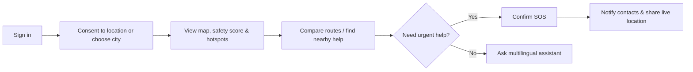

# Product Blueprint — VoyageSecure AI

## Problem statement

Tourists can struggle to find trusted, timely and understandable safety guidance when unfamiliar with a place, especially during weather events, at night, or in an emergency. They need clear options and rapid contact with help—not alarming predictions.

## Users and jobs-to-be-done

| User | Need | Product response |
|---|---|---|
| Tourist | “Help me decide how to move around safely.” | Advisory score, hotspot context and route comparison |
| Tourist in distress | “Let someone I trust know where I am now.” | Deliberate SOS and time-limited location sharing |
| Family/trusted contact | “Know that help was requested and where to look.” | Notification and secure, expiring share link |
| Demo responder | “See active prototype SOS events.” | Role-protected incident view |
| Hackathon judge | “See responsible, achievable AI.” | Explainable risk factors, sources, confidence and limitations |

## MVP journey

## Feature priority

| Priority | Feature | Rationale |
|---|---|---|
| P0 | Auth, consent, map, risk explanation, SOS, trusted contacts, help locator, fallback emergency number | Complete and safe core journey |
| P1 | Safe route alternatives, weather/disaster inputs, assistant, notification inbox, responder board | Strong differentiators for judging |
| P2 | Push notifications, crowd feed, voice input, richer analytics | Add only after core flow is stable |

## Four delivery phases

| Phase | Days | Scope | Exit demonstration |
|---|---:|---|---|
| Foundation | 1–7 | Auth, UI system, consent, Maps | New user reaches current-location map |
| Intelligence | 8–14 | Data import, hotspots, explainable risk | Risk changes with transparent factors/freshness |
| Response | 15–21 | Safe routes, nearby help, SOS, sharing | Controlled SOS reaches a demo responder/contact |
| Launch | 22–30 | Assistant, alerts, polish, deployment, pitch | Full user story works in demo mode |

## Success measures

- User reaches map after onboarding in ≤5 taps.
- Risk score returns in P95 <700 ms with factors/freshness/confidence.
- SOS creation/notification completes in ≤10 seconds under normal network conditions.
- Users can find a nearby verified hospital/police service and launch directions/call action.
- Assistant passes multilingual safety and no-hallucination evaluation set.
- No P0/P1 bug remains before demonstration.

## Explicit limitations and ethics

- Risk is advisory/aggregated; it is not a prediction, guarantee, or crime label for people/places.
- Use a pilot city and verifiable public/curated data. State collection dates and resolution.
- Do not collect location in the background by default. Share only with consent, a duration, and short retention.
- Never claim to dispatch official responders. Show 112 or verified local emergency support clearly.
- Test translation/emergency copy with fluent speakers and a mentor before presenting it as accessible.

## Definition of done for a feature

1. User story and acceptance criteria are clear.
2. API/UI states cover loading, empty, error and permission denial.
3. Unit/integration tests are written; mobile UI is checked at 360 px.
4. Accessibility, privacy and failure behavior are considered.
5. API/documentation/seed data updates are committed.
6. A teammate reviews the PR and the feature is demonstrated on staging.
