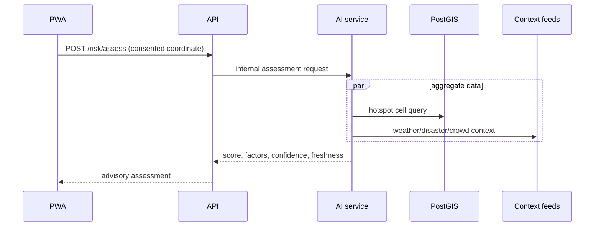

# Architecture — VoyageSecure SafeTrail AI

## Design principles

1. **Safety-critical actions degrade safely.** SOS and emergency numbers never depend on an LLM.
2. **Privacy by default.** Routine GPS is evaluated in memory/aggregate cells; precise sharing is explicit, time-limited and deleted.
3. **Explainable intelligence.** Risk factors, freshness and confidence are returned with every score.
4. **Provider isolation.** Maps, routes, weather, notifications and LLM calls sit behind adapters and have fixture fallbacks.
5. **One pilot city first.** Geographic data is scoped, source-labelled and verified.

## Container view

## Service responsibilities

| Component | Owns | Must not own |
|---|---|---|
| PWA | UI state, consent UX, cached non-sensitive shell, map presentation | API keys with server privilege, risk logic, notification delivery |
| API | auth/RBAC, CRUD, SOS state machine, routes/services, API aggregation, audit | LLM prompt business logic, raw provider UI formatting |
| AI service | risk formula, feature transformations, assistant retrieval/guardrails | auth authority, precise location persistence, emergency dispatch |
| PostgreSQL/PostGIS | approved public data, user settings, limited SOS/share records | passwords in plaintext, raw chat logs by default |
| Worker/queue | notification retries, alerts, retention cleanup, imports | synchronous page response blocking |

## Key data flows

### Risk assessment

### SOS

1. PWA requires a deliberate hold/confirm action and sends a UUID idempotency key.
2. API persists `sos_incidents` and a time-boxed location-share session in one transaction.
3. A worker sends contact notifications and records each delivery attempt.
4. PWA posts only while consented session is active; responder access is role-protected and audited.
5. Expiry job ends session and deletes precise events according to retention policy.

## Security and privacy controls

- TLS everywhere; HTTPS-only cookies where refresh tokens are used.
- Access token short-lived; refresh tokens hashed and revocable.
- RBAC: `tourist`, `responder`, `admin`; owner checks on all personal resources.
- Input validation, CORS allowlist, parameterized SQL/ORM, rate limits (especially auth/SOS/assistant), CSP and dependency scanning.
- Key management through environment/managed secret store; Google browser key origin-restricted and server keys never exposed to web client.
- PII-safe logs: request IDs, timings, state changes—not exact coordinates, chat text, tokens or contact values.
- Retention defaults: precise location events 24–72h in demo; chat text not stored unless explicitly enabled; aggregate metrics only.

## Availability and failure behavior

| Dependency unavailable | User-facing behavior | Technical behavior |
|---|---|---|
| Maps/routes | List/official directions fallback; preserve SOS | Adapter timeout, cached/static demo route |
| Context feed | Score marks stale/limited confidence | Neutral factor, circuit breaker, health metric |
| LLM | Fixed multilingual emergency/help cards | Timeout and no retries on synchronous UI path |
| Push/SMS | In-app alert/SOS status and emergency number remain | Queue retry, delivery failure visible to user |
| Database | Clear retry message; no false SOS sent state | Health check, alert, transactional writes |

## Deployment topology

Use separate development, staging and production-like demo environments. CI runs lint, tests, build, migrations on disposable DB, secret scan and dependency audit. Deploy immutable tagged builds; apply migrations before traffic shift; retain one known-good rollback. `DEMO_MODE=true` replaces fragile providers with curated fixtures for judging.

## Architecture decision records

Record material choices in `docs/adr/NNN-title.md`: context, decision, alternatives, consequences, owner and date. First ADRs: managed vs self-hosted auth, pilot city/data source, maps provider, vector retrieval choice, notification fallback, location retention period.
