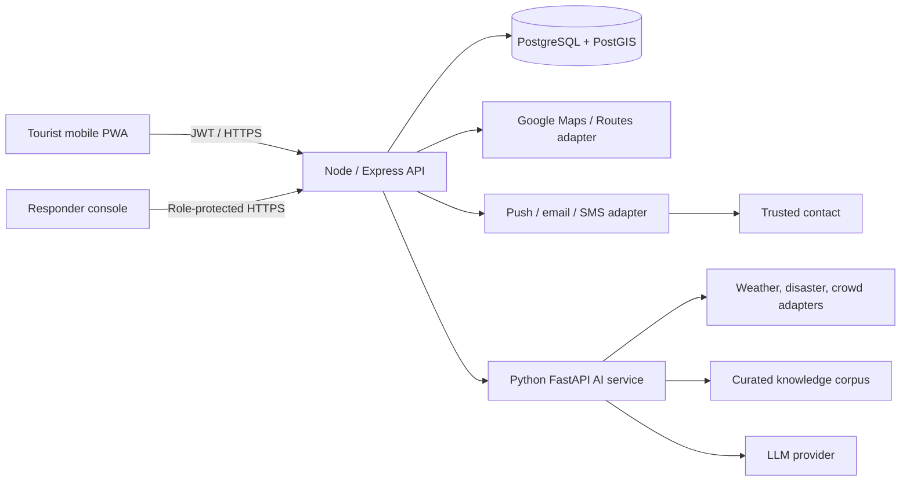
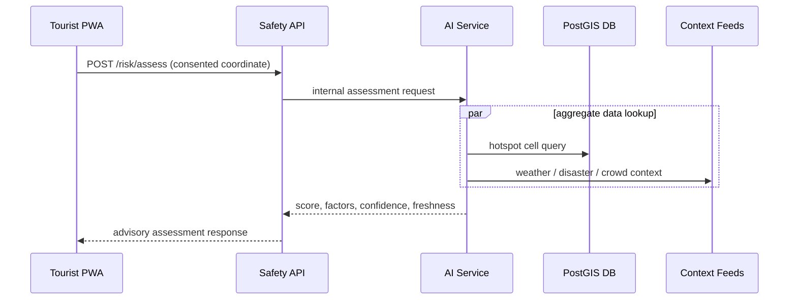

# 🏗️ System Architecture & Design Boundaries — SecureVoyage

**Comprehensive architectural blueprint, container views, data flows, and security fail-safes.**

---

## 🎯 Core Design Principles

> [!IMPORTANT]
> 1. **Safety-critical actions degrade safely:** SOS and emergency numbers never depend on an LLM or third-party service response.
> 2. **Privacy by default:** Routine GPS is evaluated in memory/aggregate cells; precise location sharing is explicit, time-limited, and deleted post-expiry.
> 3. **Explainable intelligence:** Risk factors, data freshness, and confidence levels are returned alongside every risk score.
> 4. **Provider isolation:** Maps, routes, weather, notifications, and LLM calls sit behind modular adapters with fixture fallbacks.
> 5. **One pilot city first:** Geographic data is strictly scoped, source-labelled, and verified for high data fidelity.

---

## 📦 Container View

---

## ⚙️ Service Responsibilities

| Component | Owns | Must NOT Own |
|---|---|---|
| **PWA (`apps/web`)** | UI state, consent UX, cached non-sensitive shell, map presentation | API keys with server privilege, risk logic, notification delivery |
| **API (`apps/api`)** | Auth/RBAC, CRUD, SOS state machine, routes/services, API aggregation, audit | LLM prompt business logic, raw provider UI formatting |
| **AI Service (`apps/ai-service`)** | Risk formula, feature transformations, assistant retrieval/guardrails | Auth authority, precise location persistence, emergency dispatch |
| **PostgreSQL / PostGIS (`database`)** | Approved public data, user settings, limited SOS/share records | Passwords in plaintext, raw chat logs by default |
| **Worker / Queue** | Notification retries, alerts, retention cleanup, data imports | Synchronous page response blocking |

---

## 🔄 Key Data Flows

### 📊 1. Risk Assessment Flow

---

### 🚨 2. SOS & Live Sharing Flow

> [!CAUTION]
> **SOS Incident Handling Rules:**
> 1. PWA requires a deliberate hold/confirm action and sends a UUID idempotency key.
> 2. API persists `sos_incidents` and a time-boxed location-share session in a single database transaction.
> 3. A background worker sends contact notifications and records each delivery attempt.
> 4. PWA posts updates only while the consented session is active; responder access is role-protected and fully audited.
> 5. Expiry job automatically ends session and purges precise events according to data retention policy.

---

## 🛡️ Security and Privacy Controls

> [!SECURITY]
> - **Transport Security:** TLS everywhere; HTTPS-only cookies where refresh tokens are used.
> - **Token Management:** Access token short-lived; refresh tokens hashed and revocable.
> - **RBAC Enforcement:** `tourist`, `responder`, `admin`; owner checks on all personal resources.
> - **Input Protection:** Input validation, CORS allowlist, parameterized SQL/ORM, rate limits (especially auth/SOS/assistant), CSP, and dependency scanning.
> - **Key Management:** Managed secret store; Google browser key origin-restricted; server keys never exposed to web client.
> - **PII-Safe Logs:** Request IDs, timings, state changes—never exact coordinates, chat text, tokens, or contact values.
> - **Retention Defaults:** Precise location events retained 24–72h in demo; chat text not stored unless explicitly enabled; aggregate metrics only.

---

## ⚡ Availability and Failure Behavior

| Dependency Unavailable | User-Facing Behavior | Technical Behavior |
|---|---|---|
| **Maps / Routes** | List / official directions fallback; preserve SOS capability | Adapter timeout, cached / static demo route |
| **Context Feed** | Score marks stale / limited confidence | Neutral factor substitution, circuit breaker, health metric alert |
| **LLM Provider** | Fixed multilingual emergency / help cards displayed | Timeout & no retries on synchronous UI path |
| **Push / SMS** | In-app alert / SOS status and emergency number remain active | Queue retry, delivery failure visible to user |
| **Database** | Clear retry message; no false SOS sent state | Health check alert, transactional writes |

---

## 🚀 Deployment Topology

> [!TIP]
> **Environment & Deployment:**  
> Use separate development, staging, and production-like demo environments. CI runs lint, tests, build, migrations on a disposable DB, secret scan, and dependency audit. Deploy immutable tagged builds; apply migrations before traffic shift; retain one known-good rollback.  
> `DEMO_MODE=true` replaces fragile third-party providers with curated fixtures for judging reliability.

---

## 📑 Architecture Decision Records (ADR)

Record material architectural choices in `docs/adr/NNN-title.md` covering context, decision, alternatives, consequences, owner, and date.  
**Initial ADR Focus Areas:** Managed vs. self-hosted auth, pilot city/data source, maps provider selection, vector retrieval choice, notification fallback, and location retention periods.
