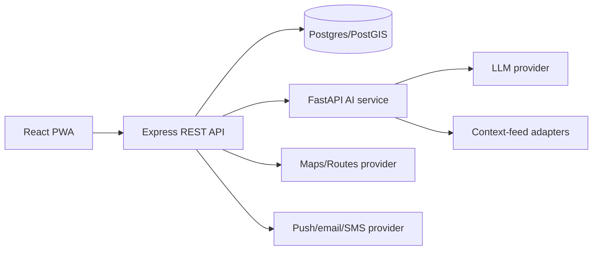

# Technology Stack and Rationale

## Recommended hackathon stack

| Layer | Choice | Why it fits 30 days / 4 developers | Alternative |
|---|---|---|---|
| Mobile web | React + TypeScript + Vite + PWA | Fast iteration, strong ecosystem, installable mobile experience | Next.js if SSR is already familiar |
| UI | Tailwind or CSS Modules + accessible primitives | Small design system without native-app overhead | Material UI if team needs prebuilt components |
| Maps | Google Maps JS + Routes/Places APIs | Familiar, polished maps/routing/nearby data | Mapbox/OSM if quota/cost policy demands |
| API | Node.js 20 + Express + TypeScript | Shared types with frontend, fast CRUD/REST delivery | NestJS if team already knows it |
| AI service | Python 3.11 + FastAPI | Natural fit for risk/data/evaluation tooling | Keep risk in Node if Python skills are absent |
| Database | PostgreSQL 15 + PostGIS | Reliable relational model + spatial queries | Supabase Postgres for managed acceleration |
| Cache/queue | Redis + BullMQ (optional) | Notification retries, risk cache, cleanup jobs | Managed queue/service if Redis is unavailable |
| Auth | Supabase Auth/Firebase Auth preferred | Avoid building security-sensitive auth from scratch | bcrypt + JWT only with mentor review |
| Notifications | FCM/Web Push + in-app inbox | Works on mobile PWA; inbox gives graceful fallback | Email for simplest demo delivery |
| AI | Grounded LLM + RAG, provider adapter | Multilingual answers without model training; controllable | Fixed FAQ only if API reliability is a concern |
| Observability | Sentry + structured logs | Rapid error triage while redacting PII | Console + hosted logs for internal prototype |
| CI/CD | GitHub Actions + Vercel/Render/Railway | Free/low-friction preview deploys | Any institute-approved cloud |

## Version and compatibility policy

- Node 20 LTS, npm 10+, Python 3.11+, PostgreSQL 15+.
- Pin Python direct dependencies in `requirements.txt`; commit `package-lock.json` for Node.
- Upgrade only during a scheduled maintenance window; never upgrade core dependencies on demo day.
- Browser support: latest Chrome Android, Safari iOS, Chrome desktop; test 360 px width first.

## Integration boundaries

Only the API service may access database credentials, privileged map/route keys, notification credentials, and the AI service. Browser code may use a restricted Maps browser key but no secret key.

## What not to build in the hackathon

- Native Android/iOS apps in parallel with the PWA
- A bespoke ML model without labelled, lawful training data
- Direct police/ambulance dispatch integration
- Nationwide “real-time” crime coverage
- Payment, social networking, or broad travel booking features

These are roadmap items, not core proof-of-value.

## Cost and quota controls

- Restrict Google APIs and use budget alerts; cache route/service results; cap user requests.
- Use a small curated knowledge base; cache FAQ; set LLM token/time limits.
- Build `DEMO_MODE` on day 1 of each provider integration so judging does not depend on quota/network availability.
- Store data freshness and source metadata; never label fixture data as live.
