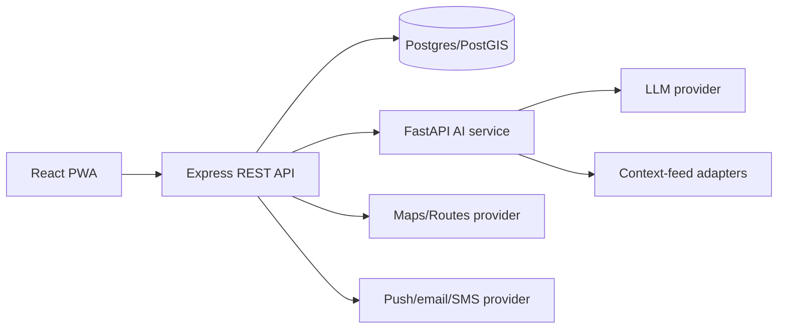

# 🛠️ Technology Stack & Architectural Rationale — SecureVoyage

**Complete technical stack choices, compatibility rules, integration boundaries, and cost controls.**

---

> [!NOTE]
> **Hackathon Strategy:** This technology stack is optimized for rapid 30-day vertical slice delivery by a team of 4 developers while maintaining security, scalability, and fail-safe safety operations.

---

## ⚡ Recommended Hackathon Stack

| Layer | Choice | Why it fits 30 days / 4 developers | Alternative |
|---|---|---|---|
| **Mobile Web** | React + TypeScript + Vite + PWA | Fast iteration, strong ecosystem, installable mobile experience | Next.js if SSR is already familiar |
| **UI System** | Tailwind or CSS Modules + accessible primitives | Small design system without native-app overhead | Material UI if team needs prebuilt components |
| **Maps & Location** | Google Maps JS + Routes/Places APIs | Familiar, polished maps/routing/nearby data | Mapbox/OSM if quota/cost policy demands |
| **Backend API** | Node.js 20 + Express + TypeScript | Shared types with frontend, fast CRUD/REST delivery | NestJS if team already knows it |
| **AI Service** | Python 3.11 + FastAPI | Natural fit for risk/data/evaluation tooling | Keep risk in Node if Python skills are absent |
| **Geospatial DB** | PostgreSQL 15 + PostGIS | Reliable relational model + spatial queries | Supabase Postgres for managed acceleration |
| **Cache & Queue** | Redis + BullMQ (optional) | Notification retries, risk cache, cleanup jobs | Managed queue/service if Redis is unavailable |
| **Authentication** | Supabase Auth/Firebase Auth preferred | Avoid building security-sensitive auth from scratch | bcrypt + JWT only with mentor review |
| **Notifications** | FCM/Web Push + in-app inbox | Works on mobile PWA; inbox gives graceful fallback | Email for simplest demo delivery |
| **AI & LLM** | Grounded LLM + RAG, provider adapter | Multilingual answers without model training; controllable | Fixed FAQ only if API reliability is a concern |
| **Observability** | Sentry + structured logs | Rapid error triage while redacting PII | Console + hosted logs for internal prototype |
| **CI/CD & Hosting** | GitHub Actions + Vercel/Render/Railway | Free/low-friction preview deploys | Any institute-approved cloud |

---

## 📌 Version and Compatibility Policy

> [!IMPORTANT]
> - **Node & Python Runtimes:** Node 20 LTS, npm 10+, Python 3.11+, PostgreSQL 15+.
> - **Dependency Locks:** Pin Python direct dependencies in `requirements.txt`; commit `package-lock.json` for Node.
> - **Maintenance Windows:** Upgrade dependencies only during a scheduled maintenance window; never upgrade core dependencies on demo day.
> - **Browser Support:** Latest Chrome Android, Safari iOS, Chrome desktop; test 360 px width first.

---

## 🏗️ Integration Boundaries

> [!SECURITY]
> **Privilege Boundary:** Only the API service may access database credentials, privileged map/route keys, notification credentials, and the AI service. Browser code may use a restricted Maps browser key but no secret key.

---

## 🚫 What NOT to Build in the Hackathon

> [!WARNING]
> Avoid over-scoping. The following features are explicitly out of scope for the 30-day MVP:
> - Native Android/iOS apps in parallel with the PWA
> - A bespoke ML model without labelled, lawful training data
> - Direct police/ambulance dispatch integration
> - Nationwide “real-time” crime coverage
> - Payment, social networking, or broad travel booking features
> 
> *These are roadmap items, not core proof-of-value.*

---

## 💰 Cost and Quota Controls

> [!TIP]
> - Restrict Google APIs and use budget alerts; cache route/service results; cap user requests.
> - Use a small curated knowledge base; cache FAQ; set LLM token/time limits.
> - Build `DEMO_MODE` on day 1 of each provider integration so judging does not depend on quota/network availability.
> - Store data freshness and source metadata; never label fixture data as live.
